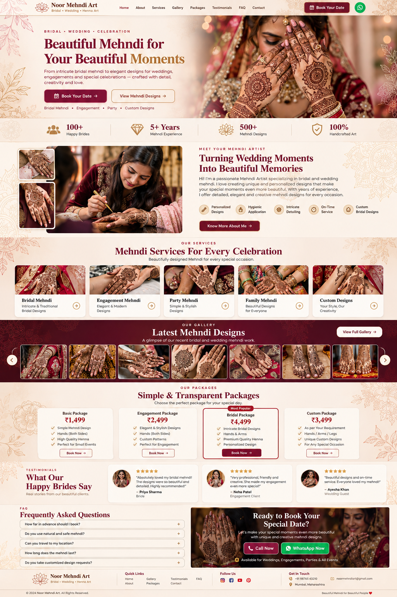

# ✨ Noor Mehndi Art - Premium Bridal Mehndi Services

<div align="center">
  
</div>
Welcome to the official repository for **Noor Mehndi Art**, a premium frontend landing page designed to showcase bridal mehndi (henna) services. The website features a luxurious, high-end aesthetic tailored for brides and event planners looking for exquisite and intricate henna designs.

---

## 🎨 Design & Aesthetic
The design focuses on a premium and traditional look, blending modern web technologies with rich aesthetics:
- **Primary Color:** Deep Burgundy/Maroon (`#6B1A2A`) - symbolizing traditional Indian bridal henna.
- **Accent Color:** Champagne Gold (`#D4AF37`) - adding a touch of luxury and festivity.
- **Backgrounds:** Soft Ivory (`#FFFDF8`) with subtle mandala/floral overlays.
- **Typography:**
  - *Playfair Display* (Serif) for elegant, bold headings.
  - *Montserrat* (Sans-serif) for clean, readable body text.

## 🚀 Features
- **Fully Responsive:** Seamless layout experience on desktop, tablet, and mobile devices.
- **Sticky Glassmorphism Header:** Dynamic navigation bar that sticks to the top upon scrolling with smooth transitions.
- **Interactive Galleries & Carousels:** Powered by OwlCarousel2 for smooth image galleries and client review swiping.
- **Off-Canvas Mobile Drawer:** Intuitive and animated sliding menu for mobile navigation.
- **Optimized for Speed (SEO):** Native `loading="lazy"` on heavy images, optimized `.webp` imagery, and deferred JavaScript loading to ensure blazing fast loading speeds.
- **Direct WhatsApp CTA:** Deep integration with WhatsApp API for instant "Book Now" interactions.
- **Accordion FAQ:** Beautifully animated Frequently Asked Questions section.

## 🛠️ Technology Stack
- **HTML5:** Semantic architecture with strict section commenting.
- **Tailwind CSS (via CDN):** Rapid UI utility classes.
- **Vanilla CSS3:** Custom variables, micro-animations, and structured stylesheets for complex components.
- **JavaScript (ES6):** Clean, modularized interactive logic (`script.js`).
- **Libraries:** jQuery (v3.7.1) & Owl Carousel 2 (v2.3.4).
- **Icons & Fonts:** FontAwesome 6 and Google Fonts.

## 📂 Project Structure
```text
├── index.html         # Main landing page
├── style.css          # Master stylesheet with custom components
├── script.js          # Interactive UI logic and carousel initialization
├── README.md          # Project documentation
└── images/            # Heavily optimized (.webp) assets
    ├── about/         # Artist and detailed henna shots
    ├── gallery/       # Portfolio masonry gallery images
    ├── hero/          # Hero banner and background patterns
    └── services/      # Service category images
```

## 💻 Local Development
Since this is a static frontend project, no complex build tools are required.
1. Clone the repository:
   ```bash
   git clone https://github.com/oneroofweb/noor-mehandi-services.git
   ```
2. Open `index.html` directly in any modern browser, or use a local live server (like VS Code Live Server) for hot reloading.

## 👨‍💻 Developed By
**Athar Ali**  
Expert Frontend Development emphasizing modularity, performance, and premium UI/UX design.

---
*Built with ❤️ for Noor Mehndi Art.*
